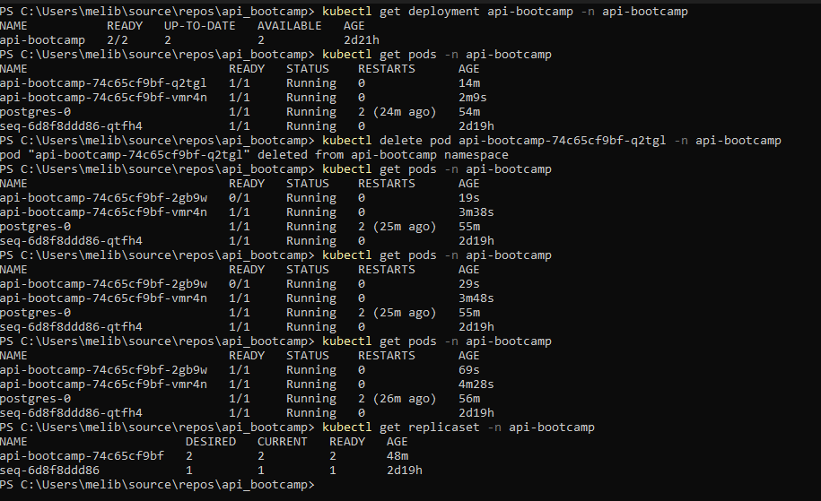
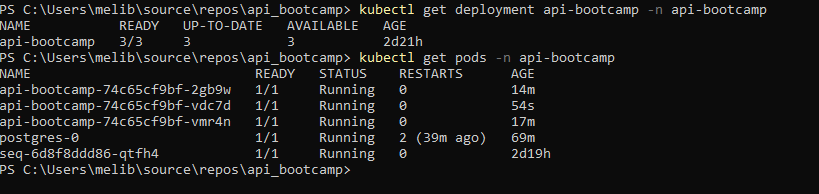
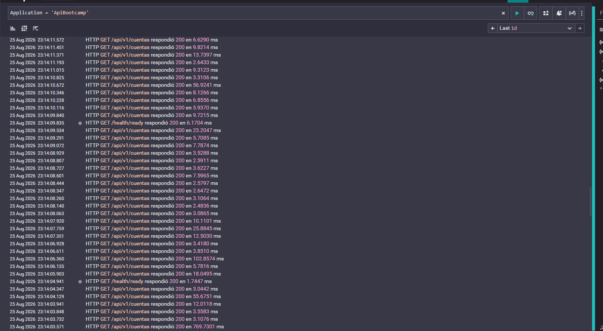
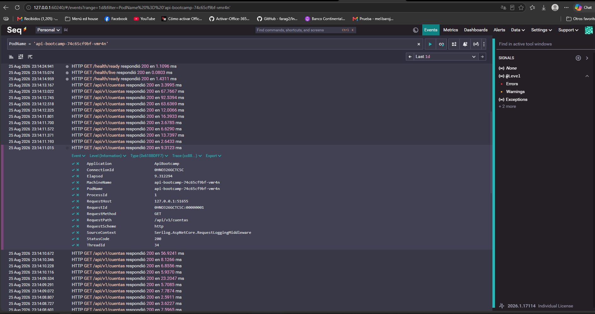
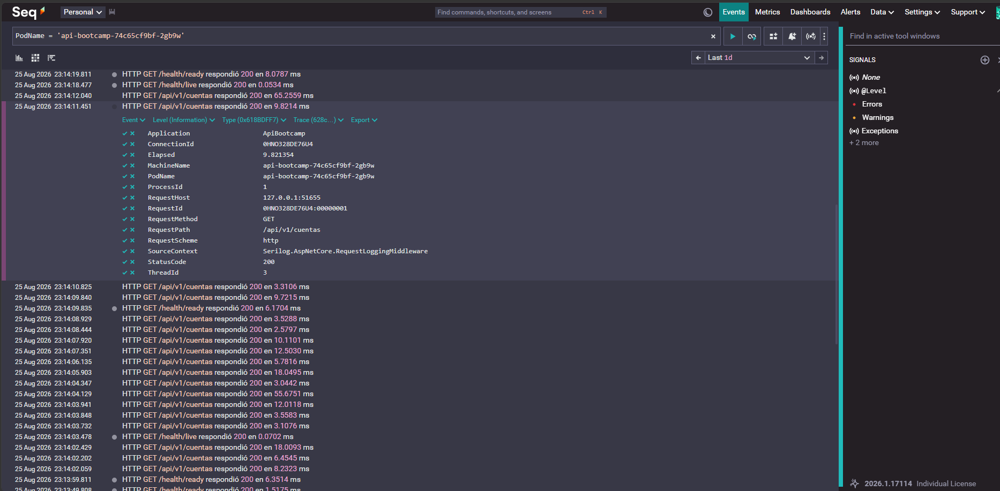
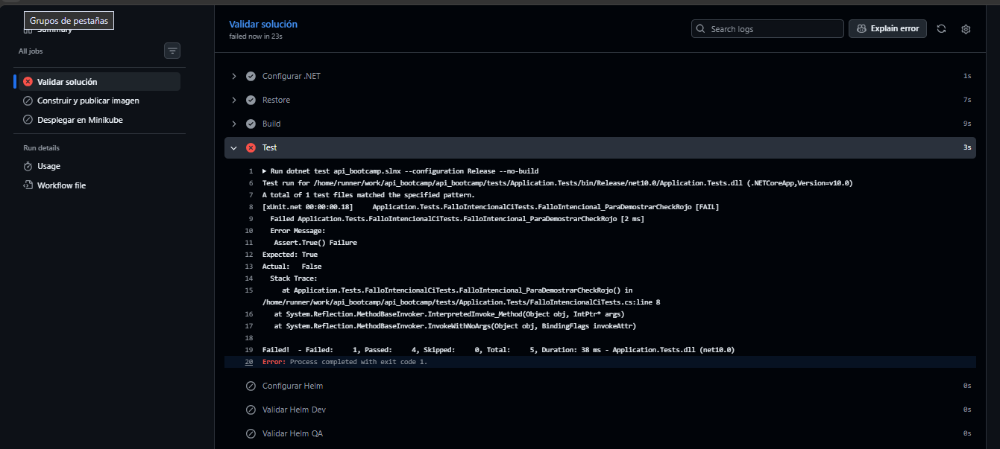
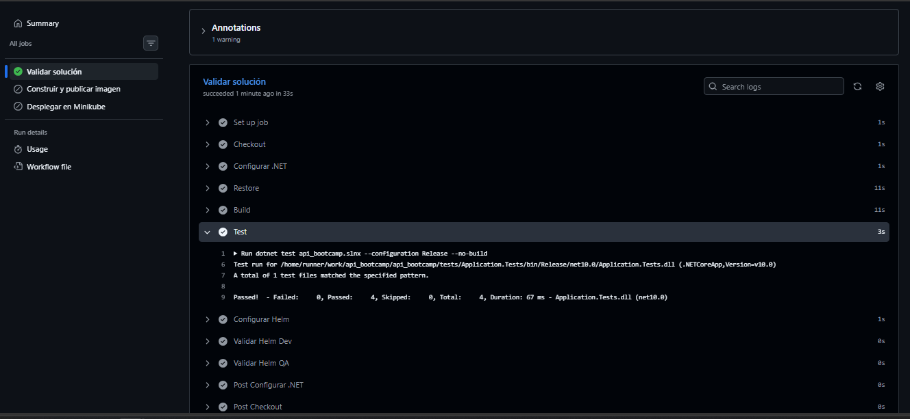

# ApiBootcamp

API REST desarrollada con .NET 10. El proyecto utiliza Clean Architecture, Entity Framework Core con PostgreSQL, MediatR, FluentValidation, Serilog, Seq, Docker, Kubernetes, Helm y GitHub Actions.

## Arquitectura

La solución está organizada en cuatro proyectos:

```text
src/
├── Api/
├── Application/
├── Domain/
└── Infrastructure/
```

- **Domain**: entidades y reglas del dominio.
- **Application**: casos de uso, CQRS, MediatR, DTOs, validadores e interfaces.
- **Infrastructure**: Entity Framework Core, PostgreSQL, repositorios y migraciones.
- **Api**: Controllers, middleware, Swagger, Health Checks, Serilog, Seq e inyección de dependencias.

## Tecnologías

- .NET 10
- ASP.NET Core
- Entity Framework Core
- PostgreSQL
- MediatR
- FluentValidation
- Serilog
- Seq
- Swagger / OpenAPI
- Docker
- Docker Compose
- Kubernetes
- Minikube
- Helm
- GitHub Actions

## Endpoints

| Método | Endpoint | Descripción |
|

---

|

---

|

---

|
| GET | `/api/v1/cuentas` | Obtener todas las cuentas |
| GET | `/api/v1/cuentas/{id}` | Obtener una cuenta por ID |
| POST | `/api/v1/cuentas` | Crear una cuenta |
| PUT | `/api/v1/cuentas/{id}` | Actualizar una cuenta |
| DELETE | `/api/v1/cuentas/{id}` | Eliminar una cuenta |

La API utiliza, entre otros, los códigos HTTP `200`, `201`, `204`, `400`, `404`, `409` y `500`.

---

# Ejecución local con Docker Compose

Docker Compose permite ejecutar la API, PostgreSQL y Seq sin Kubernetes.

```powershell
docker compose up --build -d
```

Verificar:

```powershell
docker compose ps
```

Servicios:

```text
API:        http://localhost:8080
Swagger:    http://localhost:8080/swagger/index.html
Seq:        http://localhost:5341
PostgreSQL: localhost:5433
```

Para detener el entorno:

```powershell
docker compose down
```

Para eliminar también los volúmenes y comenzar nuevamente desde cero:

```powershell
docker compose down -v --remove-orphans
```

---

# Despliegue de punta a punta con Minikube y Helm

## 1. Requisitos previos

Tener instalados:

- Git
- Docker / Docker Desktop
- .NET SDK 10
- kubectl
- Minikube
- Helm

Verificar:

```powershell
git --version
docker --version
dotnet --version
kubectl version --client
minikube version
helm version
```

## 2. Clonar el repositorio

```powershell
git clone https://github.com/eliib018/api_bootcamp.git
cd api_bootcamp
```

## 3. Restaurar, compilar y ejecutar pruebas

```powershell
dotnet restore api_bootcamp.slnx
dotnet build api_bootcamp.slnx `
  --configuration Release `
  --no-restore
dotnet test api_bootcamp.slnx `
  --configuration Release `
  --no-build
```

Los tres comandos deben finalizar correctamente antes de continuar.

## 4. Crear un clúster Minikube limpio

Se recomienda utilizar un perfil exclusivo para evitar conflictos con otros proyectos:

```powershell
minikube start `
  -p api-bootcamp-eval `
  --driver=docker `
  --cpus=2 `
  --memory=3072
```

Seleccionar el contexto:

```powershell
kubectl config use-context api-bootcamp-eval
```

Verificar:

```powershell
kubectl get nodes
```

El nodo debe aparecer con estado `Ready`.

## 5. Crear el namespace

```powershell
kubectl apply -f k8s/namespace.yaml
```

Verificar:

```powershell
kubectl get namespace api-bootcamp
```

## 6. Validar el chart Helm

El chart se encuentra en `chart/`.

La configuración no sensible se parametriza desde:

```text
chart/values.yaml
chart/values-dev.yaml
chart/values-qa.yaml
```

La contraseña real de PostgreSQL no se almacena en el repositorio. Para `lint` y `template` se utiliza solamente un valor ficticio de validación:

```powershell
helm lint chart `
  -f chart/values-dev.yaml `
  --set-string postgres.password=ci-validation
helm lint chart `
  -f chart/values-qa.yaml `
  --set-string postgres.password=ci-validation
```

Validar el renderizado:

```powershell
helm template api-bootcamp chart `
  -f chart/values-dev.yaml `
  --namespace api-bootcamp `
  --set-string postgres.password=ci-validation `
  > $null
```

## 7. Construir y cargar la imagen de la API

```powershell
docker build -t api-bootcamp:local .
```

Cargarla en Minikube:

```powershell
minikube image load api-bootcamp:local `
  -p api-bootcamp-eval
```

## 8. Desplegar la configuración y la API con Helm

El `ConfigMap` contiene configuración no sensible. El `Secret` contiene la contraseña de PostgreSQL y la cadena de conexión utilizada por la API.

Para una instalación manual se solicita la contraseña al momento de ejecutar Helm; no se guarda en Git:

```powershell
helm upgrade --install api-bootcamp ./chart `
  --namespace api-bootcamp `
  -f chart/values-dev.yaml `
  --set image.repository=api-bootcamp `
  --set image.tag=local `
  --set image.pullPolicy=IfNotPresent `
  --set-string postgres.password="$(Read-Host 'Contraseña PostgreSQL')"
```

El mismo valor se utiliza para `POSTGRES_PASSWORD` y `ConnectionStrings__PostgreSQL`, por lo que PostgreSQL y la API comparten la misma credencial.

En este momento los Pods de la API pueden quedar esperando a PostgreSQL. Es normal: el Deployment posee un `initContainer` que espera a que la base esté disponible.

## 9. Desplegar PostgreSQL

```powershell
kubectl apply -f k8s/postgres-service.yaml
kubectl apply -f k8s/statefulset-postgres.yaml
```

Esperar al StatefulSet:

```powershell
kubectl rollout status statefulset/postgres `
  -n api-bootcamp `
  --timeout=180s
```

Verificar:

```powershell
kubectl get statefulset -n api-bootcamp
kubectl get pods -n api-bootcamp
kubectl get pvc -n api-bootcamp
```

PostgreSQL se ejecuta como `StatefulSet` y utiliza `volumeClaimTemplates` para almacenamiento persistente.

## 10. Crear el Secret de Seq y desplegar Seq

El Deployment de Seq consume el Secret `seq-secret`. Para una ejecución manual se solicita la contraseña y se crea el Secret sin escribirla en el repositorio:

```powershell
kubectl create secret generic seq-secret `
  -n api-bootcamp `
  --from-literal=SEQ_ADMIN_PASSWORD="$(Read-Host 'Contraseña Seq')"
```

Aplicar Seq:

```powershell
kubectl apply -f k8s/seq-pvc.yaml
kubectl apply -f k8s/seq-deployment.yaml
kubectl apply -f k8s/seq-service.yaml
```

Esperar:

```powershell
kubectl rollout status deployment/seq `
  -n api-bootcamp `
  --timeout=180s
```

Verificar:

```powershell
kubectl get pods -n api-bootcamp
kubectl get services -n api-bootcamp
kubectl get pvc -n api-bootcamp
```

## 11. Verificar el Deployment de la API

Una vez disponible PostgreSQL:

```powershell
kubectl rollout status deployment/api-bootcamp `
  -n api-bootcamp `
  --timeout=180s
```

Verificar:

```powershell
kubectl get deployment api-bootcamp -n api-bootcamp
kubectl get pods -n api-bootcamp
```

El Deployment debe tener al menos 2 réplicas disponibles.

La definición incluye:

- `resources.requests`
- `resources.limits`
- `readinessProbe`
- `livenessProbe`
- `envFrom` para ConfigMap y Secret

## 12. Verificar las migraciones

Ver tablas:

```powershell
kubectl exec -n api-bootcamp postgres-0 -- `
  psql -U postgres -d api_bootcamp `
  -c "\dt"
```

Ver el historial de migraciones. En PowerShell se utiliza un here-string para conservar correctamente las comillas del nombre de la tabla:

```powershell
@'
SELECT * FROM "__EFMigrationsHistory";
'@ | kubectl exec -i -n api-bootcamp postgres-0 -- psql -U postgres -d api_bootcamp
```

Debe aparecer la migración versionada incluida en `Infrastructure`.

## 13. Acceder a Swagger y Health Checks

Mantener abierta una terminal con:

```powershell
kubectl port-forward `
  service/api-bootcamp `
  8080:8080 `
  -n api-bootcamp
```

Abrir:

```text
Swagger:
http://localhost:8080/swagger/index.html
Liveness:
http://localhost:8080/health/live
Readiness:
http://localhost:8080/health/ready
```

El CRUD puede probarse desde Swagger.

---

# Evidencias de Kubernetes y observabilidad

Las siguientes capturas correspondena las evidencia de los requisitos de autorecuperación, escalado y búsqueda/correlación en Seq.

## 1. Autorecuperación de Pods

Primero se verificó el estado del Deployment y de los Pods:

```powershell
kubectl get deployment api-bootcamp -n api-bootcamp
kubectl get pods -n api-bootcamp
```
El Deployment se encontraba con 2 réplicas disponibles:

```text
READY   UP-TO-DATE   AVAILABLE
2/2     2            2
```

Luego se eliminó manualmente uno de los Pods de la API:

```powershell
kubectl delete pod api-bootcamp-74c65cf9bf-q2tgl -n api-bootcamp
```

Al consultar nuevamente los Pods, Kubernetes creó automáticamente un nuevo Pod (`api-bootcamp-74c65cf9bf-2gb9w`) para recuperar el estado declarado.

También se verificó el ReplicaSet:

```powershell
kubectl get replicaset -n api-bootcamp
```

El resultado volvió a:

```text
DESIRED   CURRENT   READY
2         2         2
```

Esto demuestra la **autorecuperación**: al eliminar manualmente un Pod, Kubernetes crea otro hasta recuperar las 2 réplicas declaradas.




## 2. Escalado declarativo

Para demostrar el escalado de la aplicación se aumentó la cantidad de réplicas de 2 a 3 mediante Helm:

```powershell
helm upgrade api-bootcamp ./chart `
  -n api-bootcamp `
  --reuse-values `
  --set replicaCount=3 `
  --wait
```

Luego se verificó el Deployment y los Pods:

```powershell
kubectl get deployment api-bootcamp -n api-bootcamp
kubectl get pods -n api-bootcamp
```

La evidencia muestra:

```text
READY   UP-TO-DATE   AVAILABLE
3/3     3            3
```

y tres Pods de la API ejecutándose simultáneamente.



Para regresar a 2 réplicas:

```powershell
helm upgrade api-bootcamp ./chart `
  -n api-bootcamp `
  --reuse-values `
  --set replicaCount=2 `
  --wait
```

## 3. Búsqueda y correlación en Seq

Seq se expuso localmente mediante:

```powershell
kubectl port-forward service/seq 5341:80 -n api-bootcamp
```

Luego se realizó una búsqueda por la propiedad estructurada:

```text
Application = 'ApiBootcamp'
```

La captura muestra múltiples solicitudes `GET /api/v1/cuentas` procesadas correctamente con código HTTP `200`.



Los eventos incluyen propiedades estructuradas como:

```text
Application
PodName
RequestId
RequestMethod
RequestPath
StatusCode
```

Para demostrar que los eventos provienen de más de una réplica se realizaron búsquedas por `PodName`.

Primera réplica:

```text
PodName = 'api-bootcamp-74c65cf9bf-vmr4n'
```

En el evento se observan, entre otras propiedades, `Application = ApiBootcamp`, `RequestPath = /api/v1/cuentas`, `StatusCode = 200`, `RequestId` y el `PodName` correspondiente.



Segunda réplica:

```text
PodName = 'api-bootcamp-74c65cf9bf-2gb9w'
```

La segunda captura muestra los mismos campos estructurados, pero con un `PodName` distinto.



Esto demuestra que Seq recibe eventos generados por diferentes réplicas de la API y permite buscarlos por propiedades. `RequestId` permite correlacionar los eventos asociados a una solicitud y `PodName` identifica qué réplica la procesó.

---

# Evidencia de CI en Pull Request

Para verificar el comportamiento del pipeline se provocó intencionalmente una falla dentro de un Pull Request.

## Ejecución fallida

La ejecución de CI llegó al paso `Test`, encontró una prueba fallida y terminó con código de salida `1`.

La captura muestra `Failed: 1`, por lo que el pipeline quedó en estado rojo y los pasos posteriores no continuaron.



Después se corrigió la prueba y se volvió a ejecutar CI.

## Ejecución corregida

La nueva ejecución finalizó correctamente:

```text
Failed: 0
Passed: 4
```

También se completaron correctamente las validaciones de Helm para DEV y QA.



Flujo demostrado:

```text
Pull Request
↓
CI fallido
↓
corrección
↓
CI correcto
```

---

# Logging y observabilidad

La aplicación utiliza Serilog desde el arranque.

Los eventos se envían a:

- Consola.
- Seq mediante HTTP.

Los logs se enriquecen con propiedades estructuradas, entre ellas `Application`, `PodName` y `RequestId`.

Se utilizan niveles de severidad como:

- `Debug`
- `Information`
- `Warning`
- `Error`

La propiedad `RequestId` permite correlacionar eventos asociados a una misma solicitud y `PodName` permite identificar la réplica que procesó la solicitud.

---

# Configuración con Helm

Estructura principal:

```text
chart/
├── Chart.yaml
├── values.yaml
├── values-dev.yaml
├── values-qa.yaml
└── templates/
    ├── _helpers.tpl
    ├── configmap.yaml
    ├── deployment.yaml
    ├── secret.yaml
    └── service.yaml
```

- `values.yaml`: valores base.
- `values-dev.yaml`: configuración específica de Development.
- `values-qa.yaml`: configuración específica de QA.
- `configmap.yaml`: configuración no sensible.
- `secret.yaml`: Secret de PostgreSQL.
- `deployment.yaml`: Deployment de la API.
- `service.yaml`: Service de la API.

Los valores no sensibles de PostgreSQL, como host, puerto, nombre de base y usuario, se parametrizan mediante Helm.

La contraseña no tiene un valor real versionado y se proporciona externamente durante el despliegue.

---

# CI/CD

## Integración continua

Workflow:

```text
.github/workflows/ci.yml
```

Se ejecuta en:

```text
push a main
pull_request hacia main
workflow_dispatch
```

El job de validación mantiene el siguiente orden:

```text
Checkout
↓
Restore
↓
Build --no-restore
↓
Test --no-build
↓
Validación Helm DEV
↓
Validación Helm QA
```

El job de empaquetado depende de la validación. En `main`, construye y publica la imagen Docker en Docker Hub.

## Despliegue continuo

Workflow:

```text
.github/workflows/cd.yml
```

El CD se ejecuta después de un CI exitoso sobre `main` y utiliza un runner Windows `self-hosted`.

El flujo realiza:

1. Checkout del commit validado.
2. Verificación de Minikube.
3. Creación del namespace.
4. Creación de `seq-secret` a partir de GitHub Secrets.
5. Despliegue de la API/configuración mediante Helm.
6. Despliegue de PostgreSQL como StatefulSet.
7. Despliegue de Seq.
8. Verificación de los recursos.

## Repository Variables

```text
DOCKERHUB_USERNAME
IMAGE_NAME
K8S_NAMESPACE
```

## Repository Secrets

```text
DOCKERHUB_TOKEN
POSTGRES_PASSWORD
SEQ_ADMIN_PASSWORD
```

Las credenciales no se escriben directamente en los workflows ni se almacenan en el repositorio.

---

# Estructura general

```text
api_bootcamp/
├── .github/
│   └── workflows/
│       ├── ci.yml
│       └── cd.yml
├── README.md
├── docs/
│   └── capturas/
│       ├── 01-autorecuperacion-pod.png
│       ├── 02-escalado-3-replicas.png
│       ├── 03-seq-eventos-api.png
│       ├── 04-seq-replica-1.png
│       ├── 05-seq-replica-2.png
│       ├── 06-actions-pr-rojo.png
│       └── 07-actions-pr-verde.png
├── src/
│   ├── Api/
│   ├── Application/
│   ├── Domain/
│   └── Infrastructure/
├── tests/
├── k8s/
│   ├── namespace.yaml
│   ├── postgres-service.yaml
│   ├── seq-deployment.yaml
│   ├── seq-pvc.yaml
│   ├── seq-service.yaml
│   └── statefulset-postgres.yaml
├── chart/
│   ├── Chart.yaml
│   ├── values.yaml
│   ├── values-dev.yaml
│   ├── values-qa.yaml
│   └── templates/
│       ├── _helpers.tpl
│       ├── configmap.yaml
│       ├── deployment.yaml
│       ├── secret.yaml
│       └── service.yaml
├── Dockerfile
├── docker-compose.yml
└── api_bootcamp.slnx
```

---

# Manejo de errores

La aplicación utiliza un middleware centralizado para manejar excepciones.

Entre las respuestas controladas se encuentran:

```text
400 - errores de validación
404 - recurso no encontrado
409 - conflictos de negocio
500 - errores inesperados
```

---

# Limpieza del entorno de evaluación

Detener cualquier `port-forward` abierto con `Ctrl + C`.

Eliminar el release Helm:

```powershell
helm uninstall api-bootcamp `
  -n api-bootcamp `
  --ignore-not-found
```

Eliminar el perfil Minikube utilizado para la evaluación:

```powershell
minikube delete -p api-bootcamp-eval
```

Eliminar la imagen local de prueba:

```powershell
docker rmi api-bootcamp:local
```
